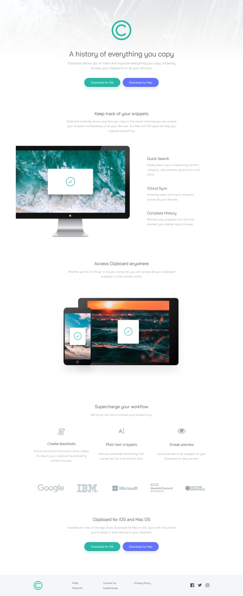

# Frontend Mentor - Clipboard landing page solution

This is a solution to the [Clipboard landing page challenge on Frontend Mentor](https://www.frontendmentor.io/challenges/clipboard-landing-page-5cc9bccd6c4c91111378ecb9). Frontend Mentor challenges help you improve your coding skills by building realistic projects.

## Table of contents

- [Overview](#overview)
  - [The challenge](#the-challenge)
  - [Screenshot](#screenshot)
  - [Links](#links)
- [My process](#my-process)
  - [Built with](#built-with)
  - [What I learned](#what-i-learned)
  - [Continued development](#continued-development)
- [Author](#author)

## Overview

### The challenge

Users should be able to:

- View the optimal layout for the site depending on their device's screen size
- See hover states for all interactive elements on the page

### Screenshot

### Links

- Solution URL: [Solution](https://github.com/socratesioa/clipboard-landing-page)
- Live Site URL: [Live Site](https://socratesioa.github.io/clipboard-landing-page)

## My process

### Built with

- Semantic HTML5 markup
- CSS custom properties
- Flexbox
- CSS Grid
- Mobile-first workflow

### What I learned

This was a very nice design file. The challenge was interesting. I didn't encounter many new things. But it was really good practice in CSS Grid and Flexbox. There were a lot of opportunities to test my knowledge.

### Continued development

As challenges get larger, it's even more important to maintain clean code. I find that with every challenge I become better at this.

## Author

- Website - [My Portfolio](https://portfolio.thisissocrates.com)
- Frontend Mentor - [@socratesioa](https://www.frontendmentor.io/profile/socratesioa)
